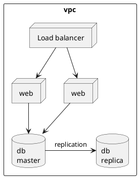

# AWS Infra for MVB

## 概要
現在、さくらのVPSで公開しているmy-vocaburary-bookを、AWS上で公開するように変更する。
また、構成を簡単な冗長化構成にしたい。

## 構成

### 構成図

```plantuml
@startuml

rectangle "vpc"{
  node "Load balancer" as road
  node "web" as web1
  node "web" as web2
  database "db\nmaster" as db_master
  database "db\nreplica" as db_replica
}

road --> web1
road --> web2
web1 --> db_master
web2 --> db_master
db_master -> db_replica : replication
@enduml
```

### 使用サービス
- Load balancer
- Auto Scaling Group
- EC2
- RDS
