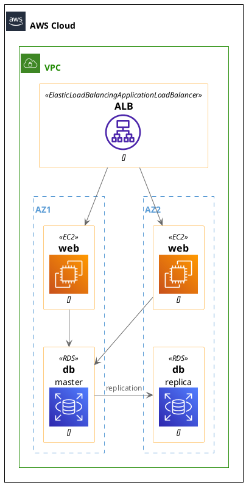

# AWS Infra for MVB

## 概要
現在、さくらのVPSで公開しているmy-vocaburary-bookを、AWS上で公開するように変更する。
また、構成を簡単な冗長化構成にしたい。

## 構成

### 構成図
chromeにて下記構成図をビルドするには、'Markdown Diagrams'という拡張をインストールしてください。


### 使用サービス
- Load balancer
- Auto Scaling Group
- EC2
- RDS


## 構築手順

1. terraformをインストール

  ```bash
  brew tap hashicorp/tap
  brew install hashicorp/tap/terraform
  brew update
  brew upgrade hashicorp/tap/terraform
  ```

  バージョン確認
  ```bash
  terraform version
  ```
  ```bash
  # 出力例
  Terraform v1.14.3
  on darwin_arm64
  + provider registry.terraform.io/hashicorp/aws v4.67.0
  ```

2. aws cliをインストール

  ```bash
  brew install awscli
  ```
  確認
  ```bash
  aws --version
  ```
  ```bash
  # 出力例
  aws-cli/2.32.16 Python/3.13.11 Darwin/23.6.0 source/arm64
  ```

3. aws configure

  下記コマンド以降、awsコマンドを実行する際に、awsアカウントの認証情報を入力する。
  ```bash
  aws configure
  ```
  ```bash
  # 出力例
  AWS Access Key ID [None]:
  AWS Secret Access Key [None]:
  Default region name [None]: ap-northeast-1
  Default output format [None]: json
  ```

## 環境変数設定

Terraformで使用する機密情報は `.env` ファイルで管理します。

1. `.env` ファイルにデータベースパスワードを設定

   ```bash
   export TF_VAR_db_password="your_secure_password_here"
   ```

2. 環境変数が読み込まれたか確認

   ```bash
   echo $TF_VAR_db_password
   ```

## Terraform実行

1. 初期化

   ```bash
   terraform init
   ```

2. **環境変数を読み込み（重要）**

   ```bash
   source .env
   ```

3. プラン確認

   ```bash
   terraform plan
   ```

## Session Managerでの接続方法

EC2インスタンスへの接続は、Session Managerを使用します。

```bash
# インスタンスID取得
aws ec2 describe-instances \
  --filters "Name=tag:Name,Values=my-vocaburary-book-web" \
  --query "Reservations[].Instances[].[InstanceId,State.Name]" \
  --output table

# Session Manager接続
aws ssm start-session --target <instance-id>
```

## HTTPS対応（ACM証明書取得後）

HTTPS化する場合は、ACM証明書を取得後、`terraform.tfvars` に以下を追加してください。

```terraform
certificate_arn = "arn:aws:acm:ap-northeast-1:xxxx:certificate/xxxx"
```
