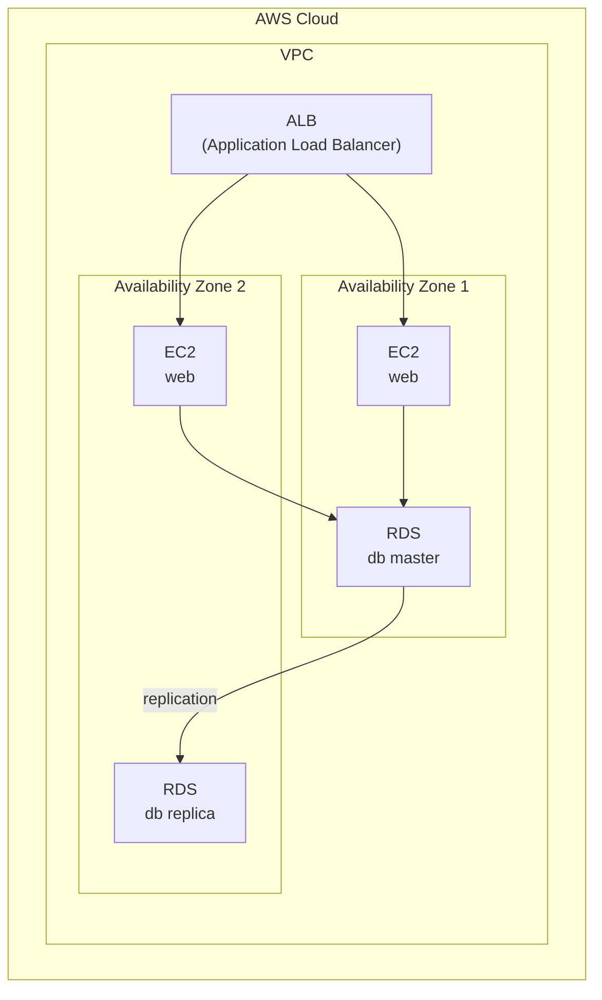

```mermaid
graph TB
    subgraph AWS["AWS Cloud"]
        subgraph VPC["VPC"]
            ALB["ALB<br/>(Application Load Balancer)"]

            subgraph AZ1["Availability Zone 1"]
                WEB1["EC2<br/>web"]
                DB_MASTER["RDS<br/>db master"]
            end

            subgraph AZ2["Availability Zone 2"]
                WEB2["EC2<br/>web"]
                DB_REPLICA["RDS<br/>db replica"]
            end
        end
    end

    ALB --> WEB1
    ALB --> WEB2
    WEB1 --> DB_MASTER
    WEB2 --> DB_MASTER
    DB_MASTER -->|replication| DB_REPLICA
```
