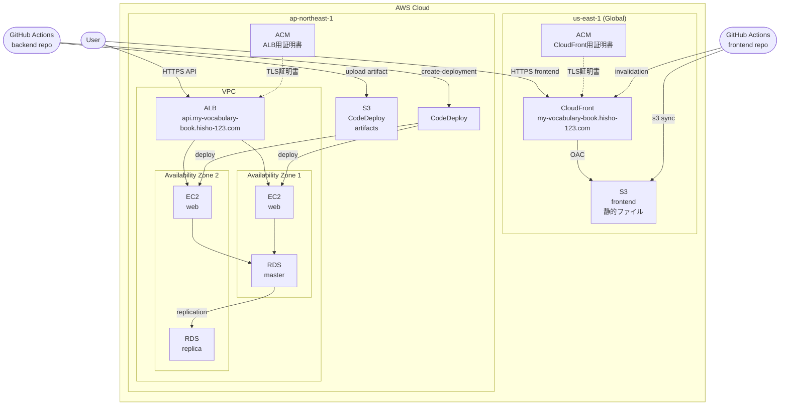

```mermaid
graph TB
    User(["User"])
    GHA_FE(["GitHub Actions\nfrontend repo"])
    GHA_BE(["GitHub Actions\nbackend repo"])

    subgraph AWS["AWS Cloud"]
        subgraph Global["us-east-1 (Global)"]
            ACM_CF["ACM\nCloudFront用証明書"]
            CF["CloudFront\nmy-vocabulary-book.hisho-123.com"]
            S3_FE["S3\nfrontend\n静的ファイル"]
        end

        subgraph AP["ap-northeast-1"]
            ACM_ALB["ACM\nALB用証明書"]
            S3_CD["S3\nCodeDeploy\nartifacts"]
            CD["CodeDeploy"]

            subgraph VPC["VPC"]
                ALB["ALB\napi.my-vocabulary-book.hisho-123.com"]

                subgraph AZ1["Availability Zone 1"]
                    WEB1["EC2\nweb"]
                    DB_MASTER["RDS\nmaster"]
                end

                subgraph AZ2["Availability Zone 2"]
                    WEB2["EC2\nweb"]
                    DB_REPLICA["RDS\nreplica"]
                end
            end
        end
    end

    %% ユーザーアクセス
    User -->|"HTTPS frontend"| CF
    User -->|"HTTPS API"| ALB

    %% フロントエンド配信
    CF -->|"OAC"| S3_FE
    ACM_CF -.->|"TLS証明書"| CF

    %% バックエンド
    ACM_ALB -.->|"TLS証明書"| ALB
    ALB --> WEB1
    ALB --> WEB2
    WEB1 --> DB_MASTER
    WEB2 --> DB_MASTER
    DB_MASTER -->|"replication"| DB_REPLICA

    %% CI/CD frontend
    GHA_FE -->|"s3 sync"| S3_FE
    GHA_FE -->|"invalidation"| CF

    %% CI/CD backend
    GHA_BE -->|"upload artifact"| S3_CD
    GHA_BE -->|"create-deployment"| CD
    CD -->|"deploy"| WEB1
    CD -->|"deploy"| WEB2
```
